# 枝刈りDFS

## DFS

ある手牌の向聴数を計算する方法として, すべての和了形との距離を計算するものがある. 重複を許すことにすればすべての和了形を探索することは下図の木のすべての葉ノードを訪問することに対応する(重複を許しても計算結果に影響を与えない). この木では根ノードが空の手牌に, 枝が面子または雀頭を手牌に追加する操作に対応している. なお, この図はイメージであり各ノードの子ノードの数は図の通りではない.

<figure text-align="center">
  
  <figcaption>図1: 和了形探索の木</figcaption>
</figure>

## 枝刈り

向聴数を計算するためには和了形との距離の最小値がわかれば十分である. そこで最小値を与えない葉ノードを子孫に持つノードへの訪問をできるだけ避けること(**枝刈り**)を考える. これには手牌への牌の追加に対して距離が**(広義)単調増加**することを利用する. 例えば手牌$h$から手牌$g$への距離が$d$とわかっているとする. ここで手牌$g$に任意の牌を1枚加えた手牌を$g'$とすると, $h$から$g$への距離$d'$は$d' \ge d$となる. 枝刈りの方法は次のようになる. 適当な葉ノードを訪問した結果, 手牌$h$と和了形との距離の最小値の暫定的な値$d_{\mathrm{tmp}}$を得たとする. 現在, 適当なノード(手牌$g$とする)にいるとする. もし$d(g, h) \ge d_{\mathrm{tmp}}$であれば, その子ノードを訪問しても$d_{\mathrm{tmp}}$が更新されることはない. よって$d(g, h) < d_{\mathrm{tmp}}$を満たすノードだけ訪問すればよい.

## 木の拡張

[向聴数](srf.md/#_4)を連立漸化式を解いて求めたい. 参照先のページで定義される$u_0, u_1, u_2, u_3, u_4, t_4$は前述の木を探索する過程で同時に計算される. 残りの$t_0, t_1, t_2, t_3$も計算されるように木を拡張する.

<figure text-align="center">
  
  <figcaption>図2: 拡張した和了形探索の木</figcaption>
</figure>

上図の木を探索することで正しく$u_m$と$t_m$が計算されることを証明する. 手牌$h$からの距離が$t_4$となる手牌$g$が存在する. 手牌$g$から見たとき適当な$m$面子0雀頭への距離は0だから$u_m \le t_4$である. 同様に任意の$m$について$u_m \le t_4, t_m \le t_4$が成り立つ. よって距離が$t_4$以下のすべての$m$面子0雀頭形と$m$面子1雀頭形を探索したとき$u_m$と$t_m$を正しく計算したと言える. ソースコードは[mkind.cpp](https://github.com/tomohxx/shanten-number/blob/master/src/mkind.cpp)を参照すること.

## 参考

本アルゴリズムは以下のソースコードを参考にした.

https://github.com/gimite/MjaiClients/blob/master/src/org/ymatsux/mjai/client/ShantensuUtil.java
