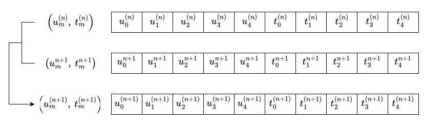

# 【図解】向聴数計算アルゴリズム

[向聴数](srf.md#向聴数)を「聴牌するために必要な牌の枚数の最小値」と定義した. これは「和了するために必要な牌の枚数の最小値」とした置換数によって与えられる.

例えば*23489m6799p22567s*という手牌は各和了形と比較すると*234789m56799p567s*という和了形を作るのに2枚必要とすることがわかる. よってこの手牌の置換数は2(1向聴)であるとする. この操作に一切の曖昧さは存在しないことが重要である. この操作を現実的に行えるかは向聴数を定義する時点では問わない.

<figure text-align="center">
  
  <figcaption>図1: 置換数(向聴数)の定義</figcaption>
</figure>

ここで手牌どうしの比較は次のように行われる. 手牌を長さ34の配列で表現し, n番目の要素がn番目の牌の枚数を表すものとする. それぞれの手牌の配列に対して要素ごとに差をとり, 正の値だけ総和をとれば一方の手牌からもう一方の手牌を作るのに必要な牌の枚数を計算できる. 例えば*123579m*から*567999m*を作るには以下のように計算して3枚必要とわかる.

$$
\begin{pmatrix}
0 \\
0 \\
0 \\
0 \\
1 \\
1 \\
1 \\
0 \\
3 \\
0 \\
\vdots \\
0
\end{pmatrix}
-
\begin{pmatrix}
1 \\
1 \\
1 \\
0 \\
1 \\
0 \\
1 \\
0 \\
1 \\
0 \\
\vdots \\
0
\end{pmatrix}
=
\begin{pmatrix}
-1 \\
-1 \\
-1 \\
0 \\
0 \\
1 \\
0 \\
0 \\
2 \\
0 \\
\vdots \\
0
\end{pmatrix}
$$

当然ながら向聴数をこの定義通りに計算することは和了形の集合のサイズが巨大であることから時間的・空間的に非現実的である. そのため各色でm面子0/1雀頭を作るために必要な牌の枚数の組合せ(これを部分置換数とする)から手牌全体で4面子1雀頭を作るために必要な牌の枚数を知ることができないか考える.

<figure text-align="center">
  
  <figcaption>図2: 部分置換数の定義</figcaption>
</figure>

先述の手牌*23489m6799p22567s*では各色の部分置換数は以下のようになる.

<figure text-align="center">
  
  <figcaption>図3: 部分置換数のテーブル</figcaption>
</figure>

これらの値から手牌全体の置換数を求めたい. $0$から$n$番目の色までの部分手牌から得られる部分置換数を$(u^{(n)}_m, t^{(n)}_m)$, $n+1$番目の色の部分手牌から得られる部分置換数を$(u^{n+1}_m, t^{n+1}_m)$とすると, これらから$(u^{(n+1)}_m, t^{(n+1)}_m)$を求めることが目標である.

<figure text-align="center">
  
  <figcaption>図4: 部分置換数の足し算</figcaption>
</figure>

この計算方法は以下の連立漸化式を解くことである.

$$
\left\{
\begin{aligned}
u^{(n+1)}_m &= \min_{0 \le l \le m} \left\{ u^{(n)}_l + u^{n+1}_{m-l} \right\} & u^{(0)}_m &= u^0_m \\
t^{(n+1)}_m &= \min_{0 \le l \le m} \left\{ \min\{ t^{(n)}_l + u^{n+1}_{m-l} , u^{(n)}_l + t^{n+1}_{m-l} \} \right\} & t^{(0)}_m &= t^0_m
\end{aligned}
\right.
$$

計算過程の一部を図示すると以下のようになる.

<figure text-align="center">
  
  <figcaption>図5: 計算過程</figcaption>
</figure>

(1)では萬子と筒子の部分手牌から4面子1雀頭を作るのに必要な枚数を計算する. このときあり得る和了形は以下のいずれかである.

1. 萬子で4面子1雀頭, 筒子で0面子
2. 萬子で3面子1雀頭, 筒子で1面子
3. 萬子で2面子1雀頭, 筒子で2面子
4. 萬子で1面子1雀頭, 筒子で3面子
5. 萬子で0面子1雀頭, 筒子で4面子
6. 筒子で4面子1雀頭, 萬子で0面子
7. 筒子で3面子1雀頭, 萬子で1面子
8. 筒子で2面子1雀頭, 萬子で2面子
9. 筒子で1面子1雀頭, 萬子で3面子
10. 筒子で0面子1雀頭, 萬子で4面子

3, 8, 9番目の和了形を作るのに必要な枚数の最小値がそれぞれ5となるため$t^{(1)}_4=5$となる. 同様に他の部分置換数も計算すればよい. 最終的な計算結果は次のようになる. $t^{(3)}_4=2$であるため手牌全体の置換数は2である. これは最初に述べたすべての和了形の集合と比較する方法による結果と一致する.

<figure text-align="center">
  
  <figcaption>図6: 計算結果</figcaption>
</figure>

このように全体の問題を部分問題の結果を利用して解く手法は**動的計画法(DP)**と呼ばれる. 実装上は部分置換数は配列に格納されるが, 図5の順番で計算することで配列の使い回し(in-place化と呼ばれる)が可能となる. ここでは$(u^{(n)}_m, t^{(n)}_m)$と$(u^{(n+1)}_m, t^{(n+1)}_m)$を同じ配列にすることができる.

本手法では事前に$(u^n_m, t^n_m)$を計算しておく必要がある. その方法として愚直にm面子0/1雀頭形と比較する全探索が最も単純であるが, [枝刈りDFS](dfs.md)や[01-BFS](01-bfs.md)といったより効率の良い方法が存在する. また, 全探索と枝刈りDFSについては並列化による高速化も可能である.

ここで解説したアルゴリズムの実装は[shanten-number](https://github.com/tomohxx/shanten-number)を参照すること.
