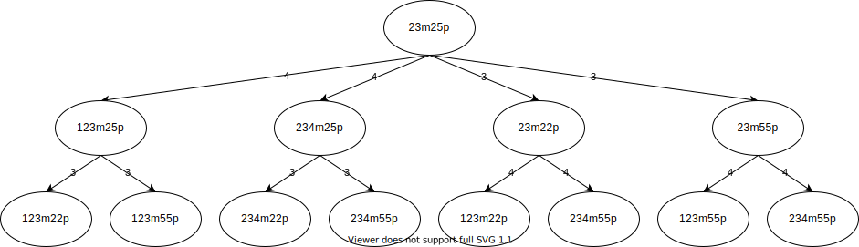
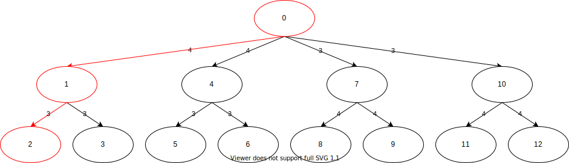

# 和了確率

## 抽象的な手牌の和了確率

ある手牌が与えられ, その向聴数と有効牌の枚数のみがわかっているとする. この手牌の置換数を$d$, 有効牌の枚数を$a^{(0)}$とする. この状態から有効牌を1枚引くごとに置換数が1ずつ減少し最終的に0になるが, この過程で有効牌の枚数が$a^{(0)}, a^{(1)}, \ldots , a^{(d-1)}$と変化する. 手牌の置換数が$d$のものから$0$のものまでの$d+1$個の状態が存在するから, 各状態の存在確率についての連立漸化式を考えれば和了確率を表せる.

$$
\left\{
\begin{aligned}
p^{(0)}_{t+1} &= \left( 1- \frac{a^{(0)}}{S-t} \right) p^{(0)}_t & p^{(0)}_0 &= 1 \\
p^{(i)}_{t+1} &= \left( 1- \frac{a^{(i)}}{S-t} \right) p^{(i)}_t + \frac{a^{(i-1)}}{S-t} p^{(i-1)}_t & p^{(i)}_0 &= 0 & (0 \le i < d) \\
p^{(d)}_{t+1} &= \frac{a^{(d-1)}}{S-t} p^{(d-1)}_t + p^{(d)}_{t} & p^{(d)}_0 &= 0
\end{aligned}
\right.
$$

ここで, $t$は巡目, $S$は0巡目での牌の総数を表す. $t$巡目における和了確率は$p^{(d)}_t$である.

## 具体的な手牌の和了確率

具体的な手牌の和了確率を考える場合, 有効牌の枚数の変化は1通りではなく引いた牌に応じて分岐する. なお, 有効牌の枚数の変化は引いた牌だけでなく捨てた牌によっても分岐するが, 議論を簡単にするためどの牌を引いたときにどの牌を捨てるかが事前に決まっているものとする. 和了へ向かう手牌の変化は次の図のように木で表せる.

和了確率はこの木に含まれるそれぞれの経路で和了する確率の和となる. 経路の集合を$L$とすると経路$l \in L$に含まれる状態の存在確率は以下の連立漸化式で表せる.

$$
\left\{
\begin{aligned}
p^{(l, 0)}_{t+1} &= \left( 1-\frac{a^{(l, 0)}}{S-t} \right) p^{(l, 0)}_t  & p^{(l, 0)}_0 &= 1 \\
p^{(l, i)}_{t+1} &= \left( 1-\frac{a^{(l, i)}}{S-t} \right) p^{(l, i)}_t + \frac{b^{(l, i-1)}}{S-t} p^{(l, i-1)}_t & p^{(l, i)}_0 &= 0 & (0 \le i < d) \\
p^{(l, d)}_{t+1} &= \frac{b^{(l, d-1)}}{S-t} p^{(l, d-1)}_t + p^{(l, d)}_t & p^{(l, d)}_0 &= 0
\end{aligned}
\right.
$$

ここで, $a^{(l, i)}$は経路$l$の深さ$i$の状態の有効牌の枚数, $b^{(l, i)}$は経路$l$の深さ$i-1$の状態から深さ$i$の状態に変化するのに必要な牌の枚数である. 例えば次の図の経路$OAB$では, 状態$O$の有効牌の枚数を$a^{(OAB, 0)}$, 状態$O$から状態$A$に変化するのに必要な牌の残り枚数を$b^{(OAB, 0)}$で表している. 同様に, 状態$A$の有効牌の枚数を$a^{(OAB, 1)}$, 状態$A$から状態$B$に変化するのに必要な牌の枚数を$b^{(OAB, 1)}$で表す. この例からわかるように$a^{(l, i)} \ge b^{(l, i)}$となる. $t$巡目で経路$l$によって和了する確率は$p^{(l, d)}_t$である.

和了確率を$P_t$とすると

$$
P_t = \sum_{l \in L} p^{(l, d)}_t
$$

となる. 
