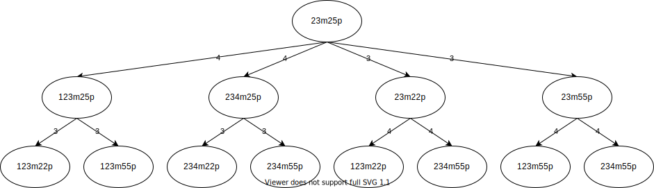
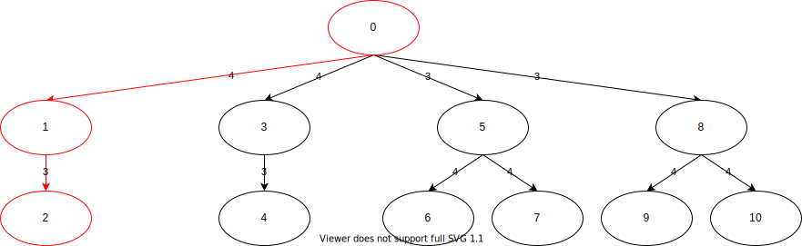

# 和了確率

## 抽象的な手牌の和了確率

ある手牌が与えられ, その向聴数と有効牌の枚数のみがわかっているとする. この手牌の置換数を$d$, 有効牌の枚数を$a^{(0)}$とする. この状態から有効牌を1枚引くごとに置換数が1ずつ減少し最終的に0になるが, この過程で有効牌の枚数が$a^{(0)}, a^{(1)}, \ldots , a^{(d-1)}$と変化する. 手牌の置換数が$d$のものから$0$のものまでの$d+1$個の状態が存在するから, 各状態の存在確率についての連立確率漸化式を考えれば和了確率を表せる.

$$
\left\{
\begin{aligned}
p^{(0)}_{t+1} &= \left( 1- \frac{a^{(0)}}{S-t} \right) p^{(0)}_t & p^{(0)}_0 &= 1 \\
p^{(i)}_{t+1} &= \left( 1- \frac{a^{(i)}}{S-t} \right) p^{(i)}_t + \frac{a^{(i-1)}}{S-t} p^{(i-1)}_t & p^{(i)}_0 &= 0 & (0 \le i < d) \\
p^{(d)}_{t+1} &= \frac{a^{(d-1)}}{S-t} p^{(d-1)}_t + p^{(d)}_{t} & p^{(d)}_0 &= 0
\end{aligned}
\right.
\tag{1}
$$

ここで, $t$は巡目, $S$は0巡目での牌の総数を表す. $t$巡目における和了確率は$p^{(d)}_t$である.

## 具体的な手牌の和了確率

具体的な手牌の和了確率を考える場合, 有効牌の枚数の変化は1通りではなく引いた牌に応じて分岐する. なお, 有効牌の枚数の変化は引いた牌だけでなく捨てた牌によっても分岐するが, 議論を簡単にするためどの牌を引いたときにどの牌を捨てるかが事前に決まっているものとする. 和了へ向かう手牌の変化は次の図のように木で表せる.

<figure text-align="center">
  
  <figcaption>図1: 4枚形23m25pの変化</figcaption>
</figure>

和了確率はこの木に含まれるそれぞれの葉ノードで和了する確率の和となる. 葉ノードの集合を$L$とすると特定の$l \in L$に到達するための途中の状態の存在確率は以下の連立確率漸化式で表せる.

$$
\left\{
\begin{aligned}
p^{(l, 0)}_{t+1} &= \left( 1-\frac{a^{(l, 0)}}{S-t} \right) p^{(l, 0)}_t  & p^{(l, 0)}_0 &= 1 \\
p^{(l, i)}_{t+1} &= \left( 1-\frac{a^{(l, i)}}{S-t} \right) p^{(l, i)}_t + \frac{b^{(l, i-1)}}{S-t} p^{(l, i-1)}_t & p^{(l, i)}_0 &= 0 & (0 \le i < d) \\
p^{(l, d)}_{t+1} &= \frac{b^{(l, d-1)}}{S-t} p^{(l, d-1)}_t + p^{(l, d)}_t & p^{(l, d)}_0 &= 0
\end{aligned}
\right.
\tag{2}
$$

ここで, $a^{(l, i)}$は深さ$i$の状態の有効牌の枚数, $b^{(l, i)}$は深さ$i$の状態から深さ$i+1$の状態に変化するのに必要な牌の枚数である. 例えば次の図の経路$0 \rightarrow 1 \rightarrow 2$では, $a^{(2, 0)} = 14, b^{(2, 0)} = 4, a^{(2, 1)} = 6, b^{(2, 1)} = 3$となる. この例からわかるように$a^{(l, i)} \ge b^{(l, i)}$となる. $t$巡目に葉ノード$l$で和了する確率は$p^{(l, d)}_t$である.

<figure text-align="center">
  
  <figcaption>図2: 手牌の変化の木</figcaption>
</figure>

和了確率を$P_t$とすると

$$
P_t = \sum_{l \in L} p^{(l, d)}_t
$$

となる. 

## パラメータ変換

(2)式の$b^{(l, i)}$を$a^{(l, i)}$で置き換えると, 形式的に(2)式を(1)式に変形できる.

$$
\left\{
\begin{aligned}
q^{(l, 0)}_{t+1} &= \left( 1-\frac{a^{(l, 0)}}{S-t} \right) q^{(l, 0)}_t  & q^{(l, 0)}_0 &= 1 \\
q^{(l, i)}_{t+1} &= \left( 1-\frac{a^{(l, i)}}{S-t} \right) q^{(l, i)}_t + \frac{a^{(l, i-1)}}{S-t} q^{(l, i-1)}_t & q^{(l, i)}_0 &= 0 & (0 \le i < d) \\
q^{(l, d)}_{t+1} &= \frac{a^{(l, d-1)}}{S-t} q^{(l, d-1)}_t + q^{(l, d)}_t & q^{(l, d)}_0 &= 0
\end{aligned}
\right.
\tag{3}
$$

(2)式の$p^{(l, i)}_{t}$と(3)式の$q^{(l, i)}_{t}$には以下の関係が成り立つ.

$$
\begin{aligned}
p^{(l, i)}_t &= q^{(l, i)}_t \prod_{j=0}^{i-1} \frac{b^{(l, j)}}{a^{(l, j)}} & (0 < i \le d)
\end{aligned}
$$

## 置換定理

: (1)式のパラメータ$a^{(i)}$の任意の置換によって得られる連立確率漸化式の解$p^{(d)}_t$はすべて等しい.

この証明は[B. 置換定理](permutation.md)を参照すること.

## ソースコード

図2で示された手牌の変化の木の和了確率を計算する.

入力:
```
ノード数 牌の枚数 巡目
ノード番号 親ノード番号(根の場合は-1) 変化に必要な牌の枚数(根の場合は-1)
```

入力例:
```
11 123 17
0 -1 -1
1 0 4
2 1 3
3 0 4
4 3 3
5 0 3
6 5 4
7 5 4
8 0 3
9 8 4
10 8 4
```

出力例:
```
0.323206
```

実装:
```cpp
#include <iostream>
#include <vector>

// 和了確率を計算する
double prob(const std::vector<int>& a, const int s, const int d, const int t)
{
  static std::vector<std::vector<double>> value(128, std::vector<double>(128, 0.0));

  value[0][0] = 1.0;

  for(int k=0; k<t; ++k){
    value[0][k+1] = (1-1.0*a[0]/(s-k))*value[0][k];

    for(int j=1; j<d; ++j){
      value[j][k+1] = (1-1.0*a[j]/(s-k))*value[j][k]+1.0*a[j-1]/(s-k)*value[j-1][k];
    }
    value[d][k+1] = 1.0*a[d-1]/(s-k)*value[d-1][k]+value[d][k];
  }
  return value[d][t];
}

// ノードを管理するクラス
struct Node{
  // 親ノード
  Node* parent = nullptr;
  // 変化に必要な牌の枚数
  int value = -1;
  // 有効牌の枚数
  int effective = 0;
};

int main()
{
  // ノード数, 牌の枚数, 巡目
  int N, S, T;

  std::cin >> N >> S >> T;

  std::vector<Node> nodes(N);

  for(int i=0; i<N; ++i){
    int self, parent, value;

    std::cin >> self >> parent >> value;

    if(parent != -1){
      nodes[self].parent = &nodes[parent];
      nodes[self].value = value;
      nodes[self].parent->effective += value;
    }
  }

  double res = 0.0;

  // 葉を見つけて和了確率を計算する
  for(int i=0; i<N; ++i){
    if(nodes[i].effective == 0){
      std::vector<int> a;

      double coeff = 1.0;

      // 根まで辿る
      for(Node* ptr=&nodes[i]; ptr->parent!=nullptr; ptr=ptr->parent){
        a.push_back(ptr->parent->effective);
        coeff *= static_cast<double>(ptr->value)/ptr->parent->effective;
      }

      // 和了確率を計算する(パラメータ変換と置換定理を利用)
      res += prob(a, S, a.size(), T)*coeff;
    }
  }

  std::cout << res << std::endl;

  return 0;
}
```
