# 和了と聴牌

## 定義

通常の意味での和了および聴牌を拡張して, $3N$和了と$3N+2$和了, $3N+2$聴牌と$3N+1$聴牌を定義する.

**$3N$和了**
: $h \in H$が$3N$ ($N$は任意の自然数)組の面子に分解できるならば, $h$は$3N$和了である.

**$3N+2$和了**
: $h \in H$が$3N$ ($N$は任意の自然数)組の面子と1組の雀頭に分解できるならば, $h$は$3N+2$和了である.

**$3N+2$聴牌**
: $h \in H$に1枚牌を加えることで$3N$和了になるならば, $h \in H$は$3N+1$聴牌である. また, このときに加えることができる牌の集合を待ちという.

**$3N+1$聴牌**
: $h \in H$に1枚牌を加えることで$3N+2$和了になるならば, $h \in H$は$3N+1$聴牌である. また, このときに加えることができる牌の集合を待ちという.

<figure text-align="center">
  
  <figcaption>図1: 手牌の状態</figcaption>
</figure>

## 和了(聴牌)になるための必要条件

一色手の牌の添字の和$s = \sum_{i=0}^{8} i h^n_i$について考える. $s$を用いることで和了(聴牌)になるための必要条件を得られる. なお, 以下の合同式では$\bmod 3$を省略している.

**3N和了になるための必要条件(定理1)**
: $s \equiv 0$が成り立つ.

> 同一の3数の和および連続する3数の和はともに3で割り切れるため成り立つ.

**3N+2和了になるための必要条件(定理2)**
: $p \equiv 2s$なる$p$番目の牌が雀頭となる.

> $s \equiv 2p$より$2s \equiv 4p \equiv p$.

**3N+2聴牌になるための必要条件(定理3)**
: $x \equiv 2s$なる$x$番目の牌が待ちに含まれる.

> 定理1より$s+x \equiv 0$. 整理して$x \equiv -s \equiv 2s$.

**3N+1聴牌になるための必要条件(定理4)**
: $x + p \equiv 2s$なる$x, p$について$x$番目の牌が待ちに含まれ$p$番目の牌が雀頭となる.

> 定理2より$p \equiv 2(s+x)$. 整理して$2s \equiv p - 2x \equiv p + x$.

## 一色手の和了(聴牌)判定アルゴリズム

### 3N和了判定

$h^n_i$の要素を$i=0$から走査し, 面子を取り出していく. $h^n_i = 1, 2, 4$のときは$h^n_i \bmod 3$個の順子を取り出す. $h^n_i = 3$のときは, 可能性として順子3個を取り出すか刻子1個を取り出すかの2通りの操作が考えられるが, 前者が可能である場合は後者も可能となる一方で, 後者が可能である場合はいつも前者が可能となるわけではない. よって$h^n_i = 3$のときは刻子を取り出すと決めてしまってよい.

```cpp
bool iswh0(const int* h)
{
  int a = h[0], b = h[1];

  for(int i=0; i<7; ++i){
    if(int r=a%3; b>=r && h[i+2]>=r){
      a=b-r; b=h[i+2]-r;
    }
    else return false;
  }
  if(a%3==0 && b%3==0) return true;
  else return false;
}
```

### 3N+2和了判定

雀頭候補を取り出した手牌が$3N$和了であるか判定する.

```cpp
bool iswh2(int* h)
{
  int s = 0;

  for(int i=0; i<9; ++i){
    s += i*h[i];
  }

  for(int p=s*2%3; p<9; p+=3){
    if(h[p] >= 2){
      h[p] -= 2;

      if(iswh0(h)){
        h[p] += 2;
        return true;
      }
      else h[p] += 2;
    }
  }
  return false;
}
```

### 3N+2聴牌判定

```cpp
int isrh2(int* h)
{
  int s = 0, wait = 0;

  for(int i=0; i<9; ++i){
    s += i*h[i];
  }

  for(int x=s*2%3; x<9; x+=3){
    if(h[x] < 4){
      ++h[x];

      if(iswh0(h)){
        wait ^= 1<<x;
      }
      --h[x];
    }
  }
  return wait;
}
```

### 3N+1聴牌判定

```cpp
int isrh1(int* h)
{
  int s = 0, wait = 0;

  for(int i=0; i<9; ++i){
    s += i*h[i];
  }

  for(int x=0; x<9; ++x){
    if(h[x] < 4){
      ++h[x];

      for(int p=(s*2-x)%3; p<9; p+=3){
        if(h[p] >= 2){
          h[p] -= 2;

          if(iswh0(h)){
            h[p] += 2;
            wait ^= 1<<x;
            break;
          }
          else h[p] += 2;
        }
      }
      --h[x];
    }
  }
  return wait;
}
```
